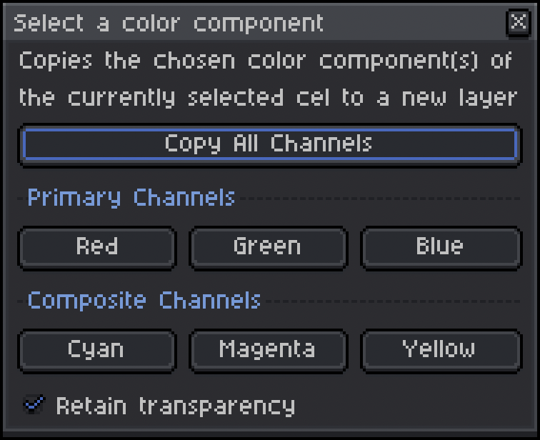

# Copy Color Channel

#### An Aseprite extension
*current release: [v1.0.0](https://sudo-whoami.itch.io/copy-color-channel)*

## Latest Changes
- Initial Release!

##
This Aseprite extension allows you copy a specific color channel (i.e. the red, green, or blue part) of the currently selected cel to a new layer.

You can also choose to copy from the composite color channels, cyan (green + blue), magenta (red + blue), and yellow (red + green).

### Requirements

This extension has been tested on both Windows and Mac OS (specifically, Windows 11 and Mac OS Sonoma 14.3.1)

It is intended to run on Aseprite version 1.3 or later and requires API version 1.3-rc5 (as long as you have the latest version of Aseprite, you should be fine!)

### Features & Usage

To use this extension, go to the Sprite menu in Aseprite and then select "Copy Color Channel..."

Then you can choose the color channel you'd like to extract, or click "Copy All Channels" to create a new layer for each channel.

Checking the "Retain Transparency" box (on by default) will also copy the alpha values from the selected cel into the new layer.

## Installation
You can download this extension from [itch.io](https://sudo-whoami.itch.io/copy-color-channel) as a "pay what you want" tool

If you find this extension useful, please consider donating via itch.io to support further development! &hearts;
